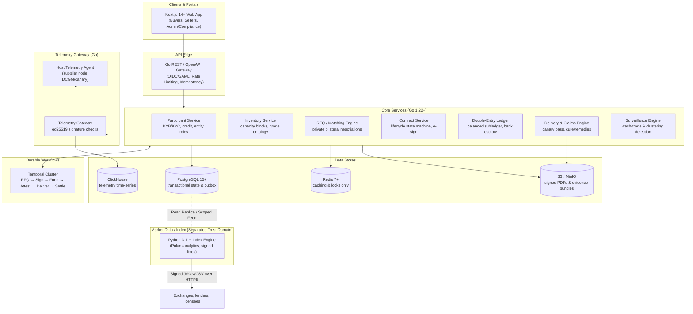

# Verinode (verinode.io)

[](https://github.com/M1D0R1x/verinode/actions/workflows/ci.yml)
[](https://golang.org)
[](https://nextjs.org)
[](https://python.org)
[](https://www.postgresql.org)
[](https://temporal.io)

> **A brokered institutional marketplace for physically delivered, enterprise GPU-capacity reservations, plus the telemetry verification and data layer that makes those forward contracts enforceable.**

---

## 1. Overview & Core Mission

Enterprise AI training and inference demand predictable, guaranteed compute access weeks or months into the future. Current options force teams into two extremes:
1. **Uncertain spot capacity** with interruption risks and variable network topologies.
2. **Opaque multi-year bilateral contracts** with zero standardized recourse if hardware performance under-delivers.

**Verinode** bridges this divide by providing:
- **Standardized Forward Contracts**: Bilateral, non-transferable capacity reservations for exact GPU topologies (initial benchmark grade: **8x NVIDIA H100 SXM/HGX, 168-hour dedicated block**).
- **Independent Hardware Telemetry & Canary Proofs**: A cryptographic host agent that validates PCI IDs, NVLink interconnect bandwidth, DCGM health, and NCCL all-reduce performance before delivery is certified.
- **Double-Entry Financial Subledger**: Institutional escrow, deposit management, and balanced settlement reconciled with regulated banking rails.
- **Trusted Market Data & Index**: An isolated analytics engine publishing volume-weighted benchmarks and cryptographically signed fixes (with strict `insufficient_data` integrity gates).

---

## 2. The Legal & Product Boundary

Verinode strictly maintains the **physical forward contract exclusion** under commodities and financial regulations. It explicitly does not conflate four distinct compute models:

| Offering | Platform Promise | Counterparty / Regulatory Risk | In Verinode Scope? |
|---|---|---|---|
| **Spot Capacity Marketplace** | Instant / near-term burst compute | Preemption, variable topology | ❌ **No** (AWS/GCP/RunPod lane) |
| **Physical Forward Reservation** | **Guaranteed future node delivery at fixed price** | Counterparty default, delivery failure | ✅ **Yes — Core Verinode Moat** |
| **Financial Derivative (Cash-Settled)** | Synthetic cash payout against an index | Speculation, leverage, licensing | ❌ **No** (CME/ICE/Nodal lane) |
| **Enterprise Bilateral Contract** | Bespoke master agreements & SLAs | Non-standard legal enforceability | ✅ **Yes — Standardized confirmation model** |

---

## 3. High-Level System Architecture



---

## 4. Tech Stack Decisions & Rationale

For the exhaustive architectural decision record, see [`docs/TECH_STACK_DECISIONS.md`](docs/TECH_STACK_DECISIONS.md).

| Layer | Technology | Decision Rationale |
|---|---|---|
| **Monorepo Topology** | Polyglot Monorepo | Keeps Contract, Ledger, Telemetry, and Protobuf contracts strictly synchronized. |
| **Frontend** | TypeScript, Next.js 14+, Tailwind CSS, TanStack Query | Fast server rendering, typed RPC/API integration, responsive RFQ and telemetry monitoring. |
| **Core Services** | Go 1.22+ | Extreme concurrency, low memory footprint, strict typing, high throughput. |
| **Workflow Engine** | Temporal | Eliminates distributed state race conditions over multi-week contract lifecycles. |
| **Primary Database** | PostgreSQL 15+ | Strict ACID transactions, foreign keys, row locks, append-only event sourcing and outbox. |
| **Telemetry Store** | ClickHouse | Ingests high-frequency hardware metrics, NVLink bandwidth, and canary results without degrading transactional DB. |
| **Cache / Locks** | Redis 7+ | Session cache and distributed locks only. **Invariant:** No authoritative balances in Redis. |
| **Document Evidence** | S3 / MinIO | Content-addressed storage (SHA-256) for signed PDFs, attestation bundles, and claim evidence. |
| **Index Analytics** | Python 3.11+ (Polars, SciPy) | Isolated in a **separated trust domain**. Reads from read replicas; enforces contributor caps and outlier rejection. |

---

## 5. Canonical Trade Envelope

Every transaction is anchored by a globally unique `trade_id` (identical to `contracts.id`), preventing cross-service state drift:

| Canonical Record | Backing Tables | Responsibility |
|---|---|---|
| `ContractSpec` | `contracts` + `grades` | Hardware grade, pricing, tenor, confirmation version |
| `Order / Trade` | `rfqs` + `quotes` | Bilateral negotiation history and accepted terms |
| `Allocation` | `inventory_blocks` | Specific reserved GPU cluster or node |
| `DeliveryEvidence` | `delivery_events` + `telemetry_attestations` | Cryptographic hardware proofs, DCGM tests, canary logs |
| `Obligation` | `contracts.state` + `claims` | Active contract lifecycle status and remedy proceedings |
| `SettlementInstruction` | `ledger_entries` + `settlements` | Balanced double-entry financial debit/credit pairs |

### Contract Lifecycle State Machine
```
DRAFT_RFQ → OPEN → QUOTED → ACCEPTED → CONTRACT_PENDING → FUNDED_SECURED →
SCHEDULED → DELIVERY_TEST → LIVE → COMPLETED → SETTLED
  ├── Exception States: CANCELLED | FAILED_DELIVERY | CURE | SUBSTITUTED | CLAIM_OPEN | DISPUTED | TERMINATED
```

---

## 6. Repository Layout

```
verinode/
├── .github/
│   └── workflows/
│       └── ci.yml               # Automated Go, Web, and Python lint/test pipeline
├── apps/
│   └── web/                     # Next.js 14+ Frontend (Buyer, Seller, Admin portals)
├── services/                    # Go Core Backend & Temporal Workers
│   ├── cmd/
│   │   └── api-gateway/         # REST / OpenAPI Edge Gateway
│   ├── internal/                # Domain services (participant, rfq, contract, ledger, etc.)
│   └── go.mod                   # Go module definition
├── index-service/               # Python 3.11+ Index & Analytics Engine (Trust-isolated)
│   └── pyproject.toml
├── packages/
│   └── proto/                   # Protobuf definitions for gRPC & cross-service schemas
├── docs/                        # Complete Product, API, and Architectural Specifications
│   ├── 01-architecture-and-getting-started.md
│   ├── 02-prd-feature-spec.md
│   ├── 03-api-specification.md
│   ├── 04-data-model-schema.md
│   ├── 05-onchain-optional-rails.md
│   ├── 06-phased-task-backlog.md
│   └── TECH_STACK_DECISIONS.md
├── docker-compose.yml           # Local dev infrastructure (Postgres, ClickHouse, Redis, MinIO, Temporal)
├── .env.example                 # Environment configuration template
└── .gitignore                   # Multi-language git ignore
```

---

## 7. Getting Started

### Prerequisites
- [Go 1.22+](https://golang.org)
- [Node.js 20+ & pnpm](https://nodejs.org)
- [Python 3.11+](https://www.python.org)
- [Docker & Docker Compose](https://www.docker.com)

### 1. Clone & Setup Environment
```bash
git clone https://github.com/M1D0R1x/verinode.git
cd verinode

# Copy environment variables
cp .env.example .env
```

### 2. Start Local Infrastructure
Start PostgreSQL, ClickHouse, Redis, MinIO, and Temporal:
```bash
docker compose up -d
```
Verify health:
```bash
docker compose ps
```

### 3. Run Core API Gateway
```bash
cd services
go run ./cmd/api-gateway
```
Check health endpoint:
```bash
curl http://localhost:8080/healthz
curl http://localhost:8080/v1/grades
```

### 4. Run Frontend (Web App)
```bash
cd apps/web
pnpm install
pnpm dev
```
Open [http://localhost:3000](http://localhost:3000) in your browser.

---

## 8. Phased Roadmap

- **Phase 0 — Concierge Pilot (Weeks 0–6)**: Standardized grade ontology v0.1 (`8x H100 SXM/HGX 168h`), event model prototypes, signed telemetry script, 10 manually brokered pilot deliveries.
- **Phase 1 — Controlled Marketplace (Weeks 6–16)**: Full Go core services, Temporal workflow execution, double-entry ledger, ClickHouse telemetry gateway, delivery canary tests, and buyer/seller web portal.
- **Phase 2 — Index & Data Layer (Months 4–8)**: Scoped index database, outlier-resistant volume-weighted median calculations, contributor tiers, and signed cryptographic fix publication.
- **Phase 3 — Enterprise Scaling (Months 7–12)**: Automated substitute routing, programmatic ERP integrations, automated credit underwriting, and secondary grades (H200, B200).
- **Phase 4 — Optional Gated Rails (On-Demand Only)**: Regulated stablecoin escrow and read-only on-chain oracle adapters (strictly off-chain authoritative).

---

## 9. License & Governance

Proprietary enterprise software. All rights reserved. See legal master agreements and compliance guidelines in [`docs/`](docs/).
