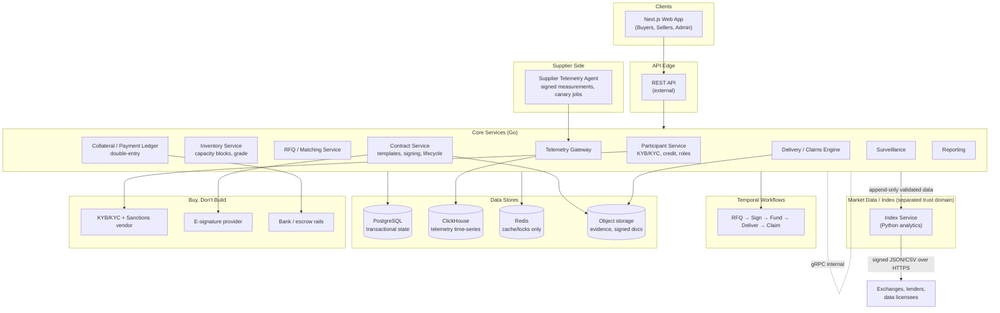

# Verinode — Architecture & Getting Started

*A brokered market for physically delivered, enterprise GPU-capacity reservations, plus the verification and data layer that makes those contracts enforceable.*

> **Suggested name: Verinode** (*Veri*fied + Compute *Node*) — short, describes the core promise (verified GPU node delivery), and reads naturally as a domain (verinode.io / verinode.dev). Alternates if you want options: **Truss Compute** (structural-support framing, evokes reliability) or **ClearNode** (clearing + node, leans into the "exchange-adjacent" positioning).

---

## 1. Architecture Overview

### 1.1 What the system actually does

Two sides trade a **bilateral, non-transferable reservation** for a physically defined GPU node (initial grade: 8x H100 SXM/HGX, 168 hours). The platform's job is to make that reservation *trustworthy*: standardized contract terms, verified delivery, independent telemetry, and — once enough real trades exist — a published price series. It is explicitly **not** a cash-settled derivatives venue (CME/ICE/Nodal already own that lane) and **not** a continuously tradable order book.

### 1.2 Product boundary: four offerings that must not be conflated

This matters as much as any single service boundary — conflating these in code (e.g., letting a "reservation" quietly behave like a tradable derivative) is the fastest way to blow up the legal position.

| Offering | Promise | Main risk | Where it lives here |
|---|---|---|---|
| Spot capacity marketplace | Compute available now/soon | Interruption and quality | **Not built by Verinode** — this is what AWS/GCP/Azure spot and neo-clouds already do |
| Physical reservation/forward (Verinode's product) | Specified future capacity at a fixed price, physically delivered | Delivery and counterparty default | Core platform: RFQ → Contract → Delivery/Claims |
| Financial derivative (cash-settled) | Cash payout based on an index | Regulation, basis, leverage, liquidity | **Not built by Verinode** — CME/ICE/Nodal or a regulated partner own this lane |
| Enterprise bilateral contract | Bespoke SLA, security, support, liability | Enforceability and customization | Contract Service's master-agreement + confirmation model; signed off-chain, optional on-chain evidence only |

A token or contract called a "GPU-hour" may legally be a service voucher, prepaid claim, forward, swap, or security depending on its actual rights, transferability, and marketing — naming it doesn't determine its classification. Keep the reservation **non-transferable** and **not marketed as an investment** by default; any change to that is a legal decision, not an engineering one.

### 1.3 High-level component diagram

### 1.4 Tech stack summary

| Layer | Choice | Notes |
|---|---|---|
| Frontend | TypeScript, React/Next.js | Enterprise SSO via OIDC/SAML |
| Core services | Go (Kotlin is an acceptable alternative if the team has stronger JVM depth) | Matching, contract state, risk, telemetry ingestion |
| Matching engine (later, higher-throughput) | Go initially; a deterministic Rust engine is a reasonable upgrade path once RFQ volume justifies it | Not needed for the Phase 1 RFQ-only model |
| Analytics/index | Python | Index research and calculation only — kept separate from core |
| External API | REST, OpenAPI schema | Client-facing |
| Internal API | gRPC, Protobuf schema | Service-to-service |
| Transactional DB | PostgreSQL | Source of truth for state; append-only event/outbox tables |
| Telemetry DB | ClickHouse | High-volume time-series |
| Cache/locks | Redis | **Never** authoritative balances |
| Evidence storage | Object storage | Contract PDFs, hashes, attestation bundles |
| Long-running workflow | Temporal | RFQ → KYC → signing → delivery → cure → claims |
| Messaging | PostgreSQL outbox initially; Kafka/Redpanda once event volume justifies it | Don't adopt Kafka on day one |
| Identity/compliance | Third-party KYB/KYC + sanctions screening vendor | Buy, don't build |
| Contracts/signing | DocuSign/Adobe Sign-class provider | Versioned templates; hash final PDF + attachments |
| Observability | OpenTelemetry, Prometheus/Grafana, Sentry, PagerDuty-class | Centralized logs |
| Infra | Kubernetes (only when needed), Terraform, managed Postgres, multi-AZ, encrypted backups | Don't over-provision early |
| Dev tooling | GitHub Actions, Renovate, Semgrep, CodeQL, Trivy, Syft/Grype, k6, Playwright, Testcontainers, dbt | |

### 1.5 Data flow (a single reservation, end to end)

1. **RFQ** — Buyer submits a private RFQ against the delivery-grade spec (`H100-SXM-8XNV-US-WEEK-DEDICATED-USD` style series grammar). State: `DRAFT_RFQ → OPEN`.
2. **Quote** — Matched/invited sellers respond via matched-principal or disclosed agency. State: `QUOTED`.
3. **Accept & contract** — Buyer accepts; Contract Service generates a confirmation under the master agreement, routes it through the e-signature provider. State: `ACCEPTED → CONTRACT_PENDING`.
4. **Funding** — Collateral/payment ledger records deposit/invoice against bank/escrow statement. State: `FUNDED/SECURED`.
5. **Scheduling & attestation** — Inventory service confirms scheduler-visible capacity; supplier telemetry agent signs hardware/topology attestation. State: `SCHEDULED → DELIVERY_TEST`.
6. **Delivery** — Credentials work, health tests and canary container pass. State: `LIVE`.
7. **Completion & settlement** — Node vacated/renewed; ledger settles; evidence archived. State: `COMPLETED → SETTLED`.
8. **Index feed** — Only *completed, verified* trades (and later, firm executable quotes) flow into the append-only dataset the Index Service reads from. Publication is a separate, gated trust domain from the trading engine.

Every transition carries actor, timestamp, reason, idempotency key, prior state, evidence hash, and authorization decision — this is what makes the system replayable and auditable, which matters both operationally and for the regulatory "intent to deliver" argument.

**Availability delivered vs. compute consumed.** These are legally and technically distinct, and the data model must keep them distinct: a seller can make reserved capacity *available* (credentials work, health tests pass) even if the buyer never actually *uses* it. The reservation contract is take-or-pay against availability, not metered against usage — don't build a metering/usage-billing path into the core reservation product; that belongs to a separate spot/metered offering if one is ever built.

### 1.6 Key modules and responsibilities

| Service | Responsibility |
|---|---|
| Participant | Legal entity, beneficial owners, roles, jurisdiction, credit, permissions |
| Inventory | Capacity blocks, grade, location bucket, availability, evidence, ownership |
| RFQ/Matching | Private RFQs, quote expiry, partial-fill rules, bilateral negotiation, audit log |
| Contract | Template/version, signed confirmation, lifecycle state, obligations |
| Collateral/Payment Ledger | Double-entry subledger reconciled to bank/escrow — **not** a casually-built custody system |
| Telemetry Gateway | Ingests signed supplier-agent measurements, challenge-response, canary jobs |
| Delivery/Claims Engine | Acceptance, uptime tracking, cure, substitution, evidence bundles, disputes |
| Market Data/Index | Independent raw-data boundary, validation, calculation, approvals, publication, revisions |
| Surveillance | Related-party detection, concentration limits, anomalous trades, wash-trade patterns |
| Reporting | Confirmations, invoices, tax records, SLA reports, benchmark files, audit export |

### 1.7 Design patterns and conventions

- **Legal confirmation is the source of truth, not the ledger or a chain.** Any blockchain use is optional evidence/mirroring, never authoritative.
- **Trust-domain separation.** Money movement, matching, benchmark administration, and telemetry are kept as distinct domains with distinct permissions — this limits blast radius and keeps the index defensible as "independent."
- **RFQ before order book.** Bespoke, sparse inventory doesn't suit continuous matching; private negotiation is the right primitive here.
- **Event sourcing / append-only state machine.** Every state transition is an immutable, replayable event with a strict lifecycle (`DRAFT_RFQ … SETTLED`, plus exception states like `CURE`, `SUBSTITUTED`, `DISPUTED`).
- **Signed publication over blockchain consensus.** The index publishes a signed canonical fix (JSON/CSV over HTTPS); any on-chain adapter just mirrors that signed payload and rejects stale/duplicate/malformed messages.
- **Buy vs. build discipline.** KYB/KYC, sanctions, e-signature, observability, paging, custody/escrow, bank connectivity → buy. Grade ontology, RFQ workflow, delivery verifier, claims evidence, surveillance, index pipeline → build (this is the moat).

### 1.8 Canonical trade envelope

Every trade, from RFQ acceptance through settlement, should be traceable through one shared identifier. Think of six canonical record types, all keyed by the same globally unique `trade_id` (this is `contracts.id` in the data model doc) and bound together in a signed canonical JSON/Protobuf envelope:

| Canonical record | Maps to (data model doc) |
|---|---|
| `ContractSpec` | `contracts` + the grade referenced by `grade_id` |
| `Order/Trade` | `rfqs` + `quotes` that produced the contract |
| `Allocation` | the `inventory_blocks` row reserved against the contract |
| `DeliveryEvidence` | `delivery_events` + the telemetry attestation/canary results referenced from them |
| `Obligation` | the current `contracts.state` plus any open `claims` |
| `SettlementInstruction` | `ledger_entries` / `settlements` tied to the contract |

Every service that touches a trade echoes `trade_id`, and every cross-service reconciliation (ledger vs. telemetry vs. index ingestion vs. any future on-chain mirror) is done **against this one record**, never by bridging state directly between two downstream systems. This is also the reconciliation anchor called out in the on-chain rails doc's no-bridging rule.

### 1.9 Risk register

| Risk | Severity | Control |
|---|---|---|
| Capacity not delivered | Critical | Seller collateral, backup pool, substitution ladder, make-good SLA |
| Poor topology/performance | Critical | Exact grade spec, acceptance benchmark, DCGM telemetry |
| Buyer/seller default | High | KYB, credit limits, prefunding/collateral, concentration caps |
| Regulatory recharacterization | Critical | Counsel, commercial users only, genuine intent to deliver, no retail leverage/transferability |
| Oracle/index manipulation | Critical | Independent contributors, transaction weighting, circuit breakers, full audit trail |
| Index basis risk | Medium | Narrow, well-defined contracts; basis analytics; never claim a perfect hedge |
| Thin liquidity | High | RFQ/auctions, position limits, no promise of continuous exit |
| Scheduler/API outage | Medium | Idempotent workflows, reconciliation jobs, manual fallback |
| Hardware telemetry fraud | High | Signed attestation, challenge-response tests, periodic human/invoice audit sampling |
| Buyer code/data exposure | Critical | Tenant isolation, encryption, vetted sellers, no customer workload content in telemetry |
| Wash trading/concentration | Critical | Surveillance, related-party detection, contributor caps |
| Smart-contract/bridge failure *(Phase 4 only, if chain rails are ever built)* | Medium initially | Minimal audited contracts, capped balances, pause controls, avoid bridges entirely |
| Stablecoin depeg/freeze *(Phase 4 only)* | Medium initially | Bank-rail settlement remains the default path; exposure limits; rapid settlement if used |

See `05-onchain-optional-rails.md` for the Phase-4-specific risks and controls in more depth, and `06-phased-task-backlog.md` for where each control becomes an actual build task.

---

## 2. Getting Started

### 2.1 Prerequisites

**Tooling**
- Node.js (LTS) + pnpm/npm, for the Next.js frontend
- Go 1.22+ toolchain
- Python 3.11+ (for the analytics/index service only)
- Docker + Docker Compose (local infra)
- Terraform CLI (infra-as-code, once you leave local dev)
- `kubectl` + a local cluster (kind/minikube) — only needed once you're past Phase 0/1
- Temporal CLI + local Temporal server (via Docker)

**Accounts / sandbox credentials (buy-vs-build vendors)**
- KYB/KYC + sanctions screening vendor sandbox
- E-signature provider (DocuSign/Adobe Sign-class) sandbox
- Bank/escrow or payments sandbox
- Object storage (S3-compatible) bucket + credentials
- GitHub org access for CI (Actions, Renovate, CodeQL, Semgrep, Trivy)

**Local data services**
- PostgreSQL 15+
- Redis
- ClickHouse (can be deferred until Phase 1 telemetry work starts)
- Kafka/Redpanda — **not needed at first**; use the Postgres outbox until event volume justifies it

**Phase 4 only — do not install by default.** These are only relevant if/when a customer request and legal clearance trigger the optional rails in `05-onchain-optional-rails.md`. Installing them up front invites building chain-dependency into the critical path by accident:
- Anchor + Solana CLI/test validator (if Solana escrow is approved)
- Foundry/Anvil or Hardhat (if an Arbitrum Orbit integration is approved)
- Hyperliquid Python/TypeScript SDKs + testnet (if a HIP-3 hedge venue is approved)
- RustRover (Solana/Rust work), Slither (Solidity static analysis) — same gating

### 2.2 Setup steps

1. **Clone the repo(s).** A monorepo (frontend + Go services + Python analytics in one repo, separate deploy pipelines) is a reasonable default given how tightly Contract/Ledger/Telemetry need to stay in sync early on.
2. **Copy environment templates** (`.env.example → .env.local` per service) and fill in:
   - `DATABASE_URL` (Postgres)
   - `REDIS_URL`
   - `CLICKHOUSE_URL` (once telemetry work starts)
   - `TEMPORAL_ADDRESS`
   - `OBJECT_STORAGE_*` (bucket, key, secret)
   - `KYC_VENDOR_API_KEY`
   - `ESIGN_PROVIDER_API_KEY`
   - `BANK_SANDBOX_*`
   - `OIDC_*` / `SAML_*` for enterprise SSO
3. **Bring up local infra:** `docker compose up -d postgres redis temporal` (add clickhouse when needed).
4. **Run migrations** for each Go service (`go run ./cmd/migrate` or equivalent per your migration tool).
5. **Seed reference data:** grade ontology (starting with the single H100 SXM/HGX 168-hour grade), region buckets, a couple of test participants.
6. **Install frontend deps:** `pnpm install` in the Next.js app.

### 2.3 Running locally

- **Core services:** `go run ./cmd/<service>` per service (participant, inventory, rfq, contract, ledger, telemetry, delivery, reporting), or a `docker compose up` target that builds and runs all of them together.
- **Temporal workers:** start the worker binary that hosts the RFQ→sign→fund→deliver→claim workflow definitions.
- **Frontend:** `pnpm dev` — point it at the local REST gateway.
- **Index/analytics (Python):** run as a separate process reading from the append-only validated dataset; keep it pointed at a *read replica or scoped view*, not direct write access to core tables, to preserve the trust-domain separation.

### 2.4 Running tests

- **Go services:** `go test ./...` per service; add `-race` in CI.
- **Contract/state-machine tests:** table-driven tests asserting every legal transition (and that illegal transitions are rejected) in the `DRAFT_RFQ → … → SETTLED` machine, including exception states.
- **Integration tests:** Testcontainers spinning up Postgres/Redis/Temporal for realistic service tests.
- **End-to-end:** Playwright against the Next.js app + a docker-composed backend.
- **Load/perf:** k6 against the RFQ and matching endpoints once you have Phase 1 volume assumptions to test against.
- **Security:** Semgrep + CodeQL in CI; Trivy/Syft/Grype for container and dependency scanning; a pre-production external penetration test before real customer data flows through.

---

## 3. Suggestions & Gaps to Resolve Early

**Documentation gaps worth closing before Phase 1 coding:**
- **Repo topology isn't specified** in the source docs — decide monorepo vs. polyrepo and CI boundaries now; it's expensive to change later given how coupled Contract/Ledger/Telemetry are.
- **No API versioning or backward-compatibility policy** is defined for the external REST surface — worth setting before any external integration partner (exchange, lender) is onboarded.
- **No secrets-management tool is named** (Vault, AWS Secrets Manager, etc.) — the doc says "hardware-backed service keys" but not how they're issued/rotated day to day.
- **Frontend state management isn't specified** — pick one (React Query + minimal client state is a reasonable default for this kind of workflow-heavy app) before the admin console and buyer/seller portals diverge in approach.
- **Admin console isn't scoped as its own component** — it's implied across almost every service (participant approval, index publication approval, surveillance review) but has no owner in the component list. Consider whether it's one app or several role-specific views.
- **No DR targets (RTO/RPO)** are stated — worth defining before you pick backup cadence and multi-AZ failover behavior, especially for the collateral ledger.
- **Confidential facility location vs. attestation** is flagged as a requirement ("specific facility may remain confidential but must be attested") but the *mechanism* (e.g., attested-but-encrypted field, zero-knowledge-ish proof, or just restricted-access field) isn't designed yet — worth a short spike before the Inventory service schema is finalized.

**Risks that deserve extra engineering attention:**
- **Regulatory recharacterization risk is the biggest single risk to the architecture**, not just the legal work: if the platform ever allows routine cash close-out, transferability, or retail-style marketing, the forward-exclusion argument weakens. This means product/engineering decisions (e.g., "should we let a buyer cash out early?") need a compliance gate, not just a legal one — worth a lightweight review step in the workflow before any new contract feature ships.
- **Telemetry fraud / hardware spoofing.** Signed attestation from a supplier agent proves the agent's signature, not that the hardware is real or in the claimed facility. The docs correctly call for combining this with invoice/serial audits and periodic human checks — make sure that human-audit workflow is actually built into the Delivery/Claims engine and not left as a manual side process.
- **Index integrity before there's enough data.** The "publish 'insufficient data,' never fabricate" rule is the most important control in the whole index design — enforce the minimum-contributor/minimum-notional thresholds as hard gates in code, not as a judgment call at publication time.
- **Collateral/custody.** The docs are explicit that this shouldn't be built casually — treat the ledger as security-critical from day one (reconciliation jobs, double-entry invariants tested continuously), even while using a third-party bank/escrow rail underneath.
- **Thin liquidity / self-dealing risk in early trades.** Since the go-to-market plan targets only ~10 deliveries in the first pilot, the surveillance service's related-party and wash-trade detection needs to exist *before* the first index calculation, not be retrofitted once volume grows.

**Reconciled from the original research doc — confirm with stakeholders before locking sprint plans:** two source documents give slightly different early-stage numbers (one targets 20-30 buyer/15-20 supplier interviews with a 5-buyer/5-seller advance gate; another targets recruiting 3 sellers + 5 anchor buyers, then 20+ completed blocks with a >98% on-time-start rate as the Phase 1 exit bar). These aren't contradictory — interview widely, recruit a smaller committed set, then hit the volume/reliability bar — but the exact thresholds should be confirmed as one number before they're wired into any automated gate (e.g., a dashboard that blocks Phase 2 work until X blocks complete). See `02-prd-feature-spec.md` and `06-phased-task-backlog.md` for where these numbers now live. Also worth adopting from that doc: **TLA+/PlusCal modeling of collateral, default, and settlement states**, and **property-based testing (proptest/Hypothesis-style) on ledger invariants** — cheap insurance given how much of the moat depends on the ledger and state machine being provably correct.
