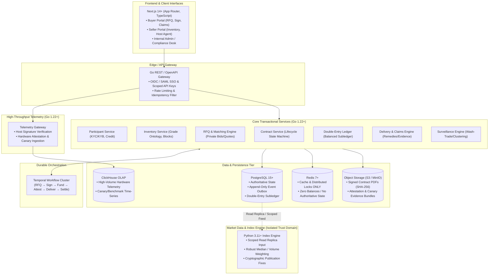

# Verinode — Technical Stack & Architectural Decisions Record (ADR)

*Authoritative architectural blueprint, technology selection rationale, trust-boundary specifications, and system invariants.*

---

## 1. Executive Summary & Core Proposition

**Verinode** is a brokered institutional marketplace for **physically delivered, enterprise GPU-capacity reservations**, accompanied by the telemetry verification and data layer that makes those contracts legally and operationally enforceable.

The initial standardized benchmark delivery grade is **8x NVIDIA H100 SXM/HGX (NVLink/NVSwitch, 168-hour continuous block)**.

### Core Legal & Structural Boundary
Verinode's competitive moat and legal posture rest on the **physical forward contract exclusion** (CFTC/Commodity Exchange Act). The platform explicitly separates itself from four easily conflated compute models:
1. **Spot Capacity Marketplace** (*AWS/GCP spot, RunPod, Lambda*): Out of scope. Verinode does not broker ad-hoc immediate compute with interruption risk.
2. **Physical Reservation / Forward** (**Verinode's Core Product**): Non-transferable bilateral reservations for physically defined future capacity at a fixed price, requiring proven physical delivery and rigorous hardware attestation.
3. **Cash-Settled Financial Derivatives** (*CME/ICE/Nodal, synthetic perpetuals*): Out of scope. Verinode never offers continuous cash-settled contracts, leverage, or synthetic retail perpetuals.
4. **Enterprise Bilateral Contracts**: Supported purely as standardized confirmation contracts executed under master service agreements.

---

## 2. Technology Stack Selection & Rationale



### Detailed Layer Breakdown

| Component | Selected Technology | Technical Rationale & Alternatives Considered |
|---|---|---|
| **Frontend Applications** | **TypeScript, React 18/19, Next.js 14+ (App Router), Tailwind CSS, shadcn/ui, TanStack Query** | High performance, server-side rendering for landing pages, client-side interactivity for real-time RFQ negotiation and telemetry dashboards. TanStack Query manages asynchronous server state cleanly. Enterprise SSO ready (OIDC/SAML). |
| **Core Microservices** | **Go (v1.22+)** | Concurrency primitives (goroutines/channels) excel at high-throughput API processing and real-time state machines; predictable low latency, strong typing, zero-dependency static binaries. Outperforms Node/Python for ledger and matching safety while simpler to maintain than Rust in early phases. |
| **Workflow Orchestration** | **Temporal.io** | Critical for complex, multi-week human-and-system lifecycles (`RFQ → E-Sign → Deposit → Provision → Hardware Canary → Live Delivery → Cure / Claims → Settlement`). Eliminates fragile database polling loops, ad-hoc state-flag machines, and cron races. |
| **Authoritative State Store** | **PostgreSQL 15+** | Uncompromising ACID transactions, row-level locks, strict foreign-key constraints, JSONB support for immutable audit logs, and transactional outbox tables. |
| **Telemetry Time-Series Store** | **ClickHouse** | Columnar storage purpose-built for ingesting millions of GPU telemetry records (PCI IDs, NVLink bandwidth, DCGM metrics, thermals, canary workloads). Partitioned by month and `block_id`. |
| **Distributed Cache & Locks** | **Redis 7+ (Alpine)** | Session caching, API rate-limiting, and distributed locking (Redlock). **Strict architectural invariant:** Redis never stores financial balances or authoritative contract states. |
| **Document & Evidence Store** | **AWS S3 / Cloudflare R2 / MinIO (S3-compatible)** | Content-addressed storage for executed PDF master agreements, cryptographic hardware attestation bundles, and claim evidence attachments. Referenced in PostgreSQL via SHA-256 hashes. |
| **Market Data / Index Engine** | **Python 3.11+ (Polars, SciPy, Pydantic, FastAPI)** | Pure analytics pipeline. Decoupled in a **separated trust domain**. Runs robust volume-weighted medians, contributor caps, clustering detection, and automated `insufficient_data` threshold enforcement. |
| **Inter-Service Communication** | **gRPC / Protocol Buffers (Internal) & REST / OpenAPI (External)** | High-performance, contract-first binary gRPC for low-latency internal microservices; OpenAPI/JSON over HTTPS for public client APIs with idempotency enforcement. |

---

## 3. Trust-Domain Separation & Buy vs. Build Matrix

### Trust-Domain Isolation
1. **Trading Operations vs. Index Calculation**: The Index Calculation Engine operates in a distinct security and permission realm. It only receives sanitized, validated completed transaction data via read-only channels or scoped outbox streams. It has **no write access** to trading, ledger, or participant databases.
2. **No Metering in Core Reservations**: Capacity reservations are take-or-pay against hardware **availability** (verified credentials, active health canaries, topology verification), **not compute consumption**. Customer workload telemetry is never ingested or examined.

### Buy vs. Build Discipline
To maximize engineering velocity on core differentiators while maintaining enterprise compliance:

| Domain | Decision | Preferred Provider / Implementation |
|---|---|---|
| **KYB / KYC & Sanctions** | **BUY** | Persona, Trulioo, or ComplyAdvantage (Automated OFAC, beneficial ownership, AML screening). |
| **Legal E-Signatures** | **BUY** | DocuSign or Adobe Sign API (Tamper-evident legal contracts, audit logs, PDF hashing). |
| **Banking / Escrow Rails** | **BUY** | Modern Treasury, Mercury API, or Tier-1 Escrow Provider. |
| **Hardware Grade Ontology** | **BUILD** | Proprietary specification of GPU SKU, VRAM, NVLink topology, and NCCL all-reduce benchmark floors. |
| **Telemetry & Canary Verifier** | **BUILD** | Proprietary host agent producing ed25519-signed hardware snapshots and synthetic workload proofs. |
| **Double-Entry Subledger** | **BUILD** | Provably balanced double-entry accounting engine with automated zero-sum invariants. |
| **Surveillance & Wash-Trading Engine** | **BUILD** | Anomaly detection for circular transactions, related-party bidding, and spoofed RFQs. |
| **Canonical Index Methodology** | **BUILD** | Robust median algorithms, contributor caps, and cryptographically signed publication fixes. |

---

## 4. The Canonical Trade Envelope

Every transaction is anchored by a globally unique `trade_id` (identical to `contracts.id`). All downstream systems reference this canonical anchor:

```
[ContractSpec]            contracts + grades
       │
[Order / Trade]           rfqs + quotes
       │
[Allocation]              inventory_blocks (reserved node)
       │
[DeliveryEvidence]        delivery_events + telemetry_attestations + canary_results
       │
[Obligation]              contracts.state + open claims
       │
[SettlementInstruction]   ledger_entries + settlements
```

**Cross-Service Reconciliation Rule:** Reconciliations between the ledger, telemetry, index ingestion, and any future chain adapters must execute against the canonical `trade_id`, never via loose heuristics or timestamp matching.

---

## 5. Architectural Invariants

1. **Physical Forward Exclusion Compliance**: Bilateral, physically delivered, non-transferable capacity only. No continuous order books, no retail trading, no cash settlement without physical delivery attempt.
2. **Double-Entry Invariant**: Every financial transaction must create balanced debit and credit entries such that `SUM(amount_cents) == 0` grouped by `transaction_id` and `currency`.
3. **Event-Sourced Contract Transitions**: The `contracts` table reflects current state; `contract_events` is an immutable, append-only ledger of every transition containing actor, timestamp, prior state, new state, reason, evidence hash, and a unique `idempotency_key`.
4. **Data Integrity Over Index Vanity**: The Index Engine must publish `insufficient_data: true` when minimum contributor counts or liquidity thresholds are unmet. It will never interpolate or fabricate index prices.
5. **Zero Customer Data Ingestion**: The Telemetry Gateway strictly ingests hardware metrics (PCI IDs, DCGM thermals/ECC errors, driver versions, synthetic NCCL benchmark timings). Customer code, model weights, prompts, and training data are strictly excluded.
